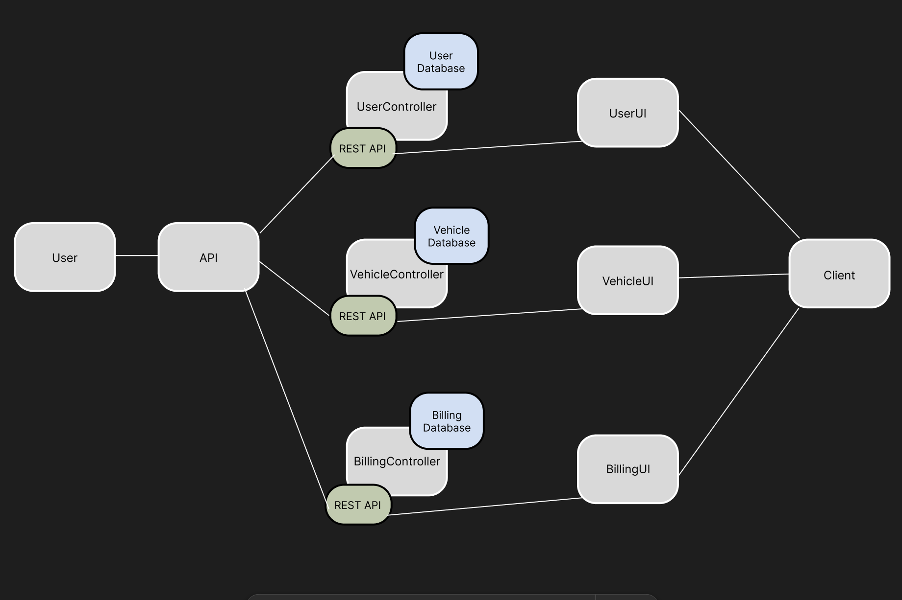

# CNAD-Assignment-1

## Architecture Design

## Design Consideration of Microservice
I split my functions into MVC format, where Controller contains all the functions that interact with the database and UI. Database contains all the data needed for the controller, which is the same for the UI as well. All my different controllers (User, Vehicle, Billing) are separated as well, this is to avoid confusion and making it more organised. The same format has been done for my database and UI as well. My main page containing the handlers for the different pages have been grouped up according to the controllers too.

## Instructions for setting up and running my microservices
 For the database, it is better to have your own username, password, db name and host on your own device environment variables. You can copy and paste the sql into your software and run all of it before running the main.go file. Once you are done with the database, run the main.go file and everything would be set up.